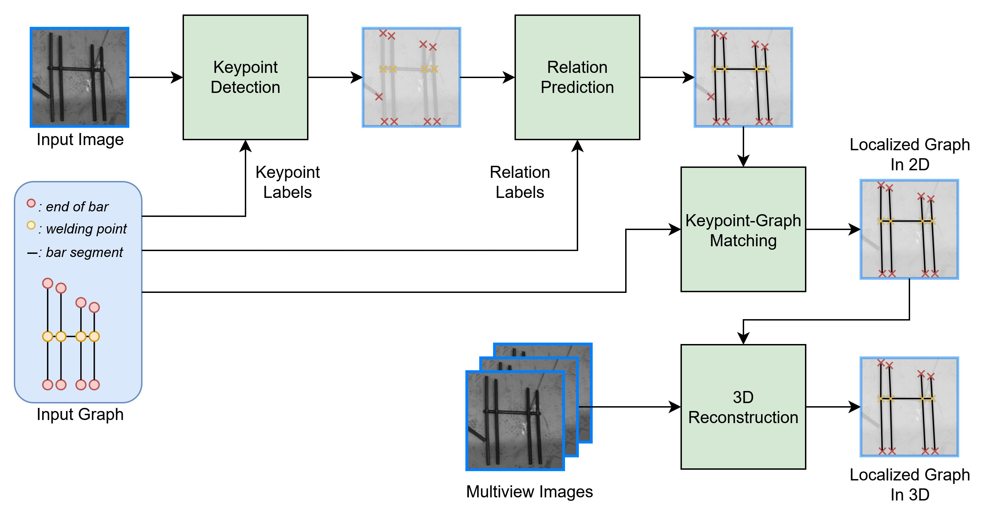
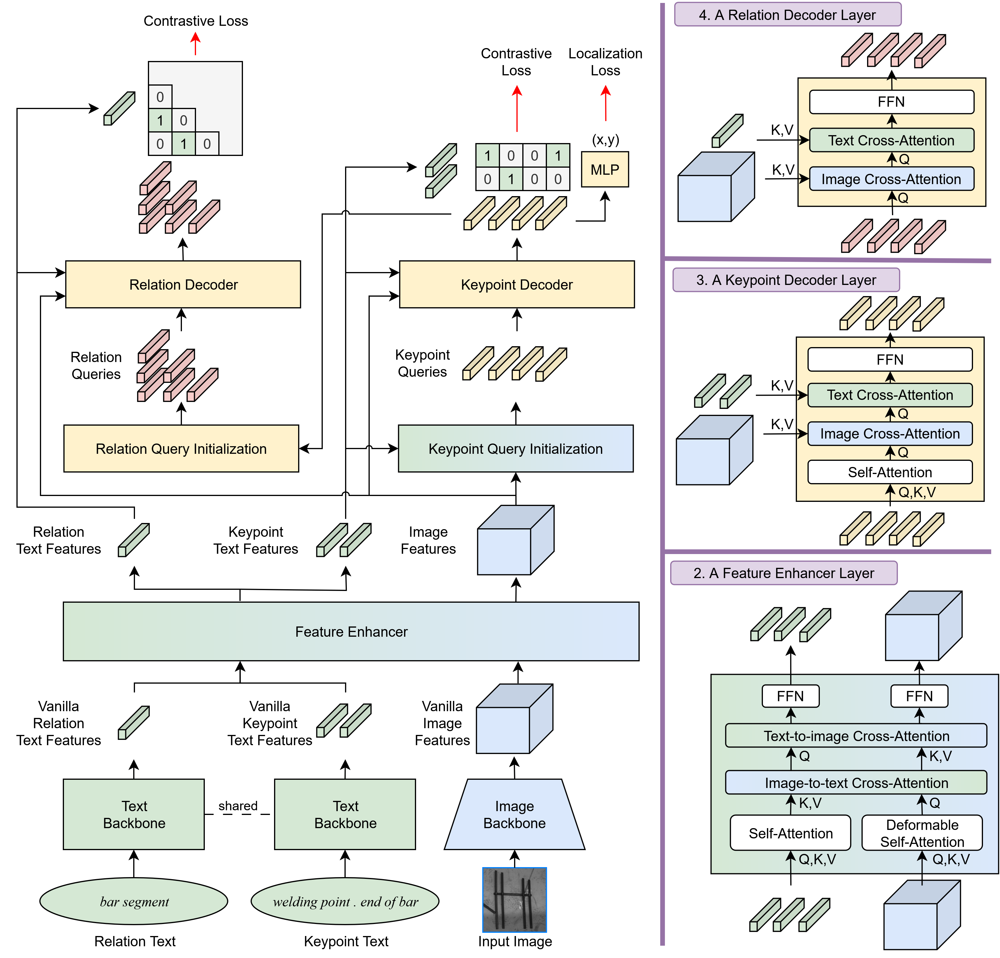

# Natural-Language-Labeled Keypoint Graphs for Industrial Object Localization

This repository contains the code for the Master's thesis **"Natural-Language-Labeled Keypoint Graphs for Industrial Object Localization"** by Patrick Tirler, advised by Prof. Justus Piater at the University of Innsbruck.

## Abstract

As industries increasingly move toward automation, the ability to visually localize objects and estimate their pose, including rigid and non-rigid transformations, becomes ever more critical. Due to the diversity and complexity of industrial objects, a robust localization system is desired to handle a wide range of objects appearing in diverse configurations and compositions while
maintaining high accuracy.

Conventional pose estimation methods are limited to specific object categories, whereas category-agnostic approaches attempt to generalize across classes of objects. However, these approaches remain limited in accuracy and in their ability to handle composite objects with repeated and non-unique components.

This thesis presents a general framework for object localization based on keypoint graphs, where nodes represent keypoints and edges encode pairwise relations. Both nodes and edges are annotated with natural language descriptions, enabling flexible integration of semantic knowledge. This representation allows for the modeling of complex objects with non-unique keypoints while leveraging structural context for disambiguation.

Building on this representation, the thesis introduces a novel neural network architecture that accepts keypoint graphs as prompts and predicts the image coordinates of graph nodes corresponding to an object instance. The model can incorporate prior knowledge, such as the expected locations of keypoints, to reduce ambiguity. Furthermore, the framework naturally extends to multi-instance detection and 3D localization through multiview imaging and stereo-based reconstruction.

Extensive experiments on industrial datasets demonstrate that the proposed approach drastically outperforms existing category-agnostic pose estimation methods for objects with repeated parts. Additionally, the approach achieves competitive performance with state-of-the-art pose estimation techniques on public benchmarks while offering greater flexibility in representing and
localizing complex objects.

## Architecture

The proposed workflow consists of (1) keypoint detection, (2) relation prediction between pairs of keypoints, (3) keypoint graph matching to assign detected keypoints to graph nodes, and (4) 3D scene reconstruction and object pose estimation. 

[](figures/overview.png)

The architecture for keypoint detection and relation prediction is based on Grounding DINO and extends it to predict keypoints and relations between them. The model takes an image and a keypoint graph as input, where the graph consists of nodes (keypoints) and edges (relations). Each node and edge is associated with a natural language description.

[](figures/architecture.png)

## Getting Started

### Setup

1. Clone the repository
2. Add the repository to your Python path:
   ```bash
   export PYTHONPATH=$PYTHONPATH:/path/to/grounding_pose # Linux
   set PYTHONPATH=%PYTHONPATH%;C:\path\to\grounding_pose # cmd
   $env:PYTHONPATH="$env:PYTHONPATH;C:\path\to\grounding_pose" # PowerShell
   ```
3. Follow the installation instructions in the [Grounding DINO repository](https://github.com/open-mmlab/mmdetection/blob/dev-3.x/configs/grounding_dino/README.md)
4. Prepare the dataset as described in `.\data\README.md`

### Training

1. Add a configuration file for your training in the `configs` directory.
2. Use the following command to start training:
   ```bash
   mim train mmdet configs/your_config_file.py
   ```


### Testing
1. Use the following command to test your model:
   ```bash
   mim test mmdet configs/your_config_file.py --checkpoint path/to/your/checkpoint.pth
   ```

### Inference
1. Use the following command to run inference on a single image or a folder of images:
   ```bash
   python tools/inference.py \
       <path/to/image_or_folder> \
       configs/your_config_file.py \
       --weights path/to/your/checkpoint.pth \
       --out-dir path/to/save \
       --texts "keypoint prompt 1 . keypoint prompt 2" \
       --relation-texts "relation prompt 1 . relation prompt 2" \
       -c
   ```